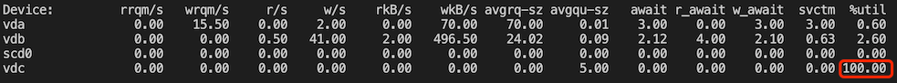

## 使用 iostat 检查设备是否 hang 住

```bash
iostat -xhd 2
```

如果有 100% 的 `%util` 的设备，说明该设备基本 hang 住了




## 查找 D 状态的进程

D 状态 (Disk Sleep) 表示进程正在等待 IO，不可中断，正常情况下不会保持太久，如果进程长时间处于 D 状态，通常是设备故障

```bash
ps -eo pid,ppid,stat,command
ps -eo pid,ppid,stat,command | awk '{if ($3=="D") {print $0}}'
```